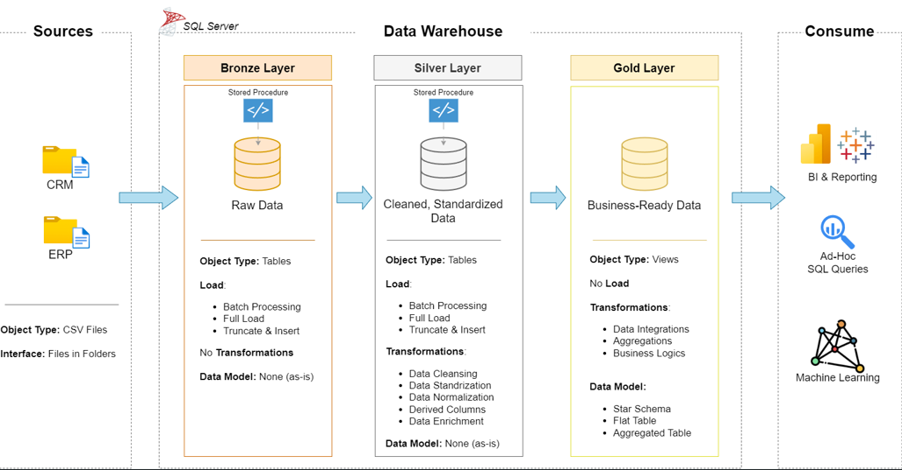

# 🚀 Data Warehouse & Analytics Project

Welcome to the **Data Warehouse and Analytics Project** repository!  
This project demonstrates an end-to-end modern data warehousing and analytics solution — from ingesting raw data to delivering actionable insights.

Perfect for professionals and students looking to showcase their expertise in:
- Data Architecture  
- SQL Development  
- ETL Pipelines  
- Data Modeling  
- Business Intelligence & Reporting  

---

## 🏗️ Data Architecture – Medallion Model

This project follows the **Medallion Architecture** using three distinct layers:

- **Bronze Layer**: Raw data ingestion from source systems (CSV files → SQL Server).  
- **Silver Layer**: Cleaned and transformed data, standardized for quality and consistency.  
- **Gold Layer**: Star schema models (Fact & Dimension tables) for business analytics and reporting.

---

## 📖 Project Scope

This project includes:

1. **Data Architecture**  
   Design and implementation using the Medallion pattern (Bronze → Silver → Gold).

2. **ETL Pipelines**  
   Build SQL-based pipelines to extract, transform, and load data.

3. **Data Modeling**  
   Create optimized star schema models for analytical workloads.

4. **Analytics & Reporting**  
   Develop SQL queries and dashboards to deliver insights on:
   - Customer Behavior  
   - Product Performance  
   - Sales Trends  

🎯 This project is designed to simulate a real-world business scenario using structured datasets from ERP and CRM systems.

---

## ⚙️ Project Requirements

### Data Engineering

- **Data Sources**: Two CSVs simulating ERP and CRM systems  
- **Platform**: SQL Server Express & SSMS  
- **Integration**: Combine and model data into a unified star schema  
- **Quality**: Clean, standardize, and prepare data for reporting  
- **Documentation**: Clear metadata and documentation for all stakeholders  

### Analytics & BI

- Generate key business metrics through SQL-based queries
- Deliver reports on sales performance, customer insights, and trends
- Provide data-driven support for strategic decision-making

🗂️ More details in [`docs/requirements.md`](docs/requirements.md)

---

## 📂 Repository Structure

data-warehouse-project/
│
├── datasets/ # Raw CSV datasets (ERP and CRM)
│
├── docs/ # Architecture diagrams & documentation
│ ├── etl.drawio
│ ├── data_architecture.drawio
│ ├── data_catalog.md
│ ├── data_flow.drawio
│ ├── data_models.drawio
│ ├── naming-conventions.md
│
├── scripts/ # SQL scripts for ETL and modeling
│ ├── bronze/ # Raw data load scripts
│ ├── silver/ # Transformation scripts
│ ├── gold/ # Star schema scripts
│
├── tests/ # SQL quality checks & test queries
│
├── README.md # Project overview and instructions
├── LICENSE # MIT License
├── .gitignore # Git ignore rules
└── requirements.txt # Dependencies and tools used

## 🧰 Tools & Resources

All tools used are free and publicly available:

- [**SQL Server Express**](https://www.microsoft.com/en-us/sql-server/sql-server-downloads)  
- [**SQL Server Management Studio (SSMS)**](https://learn.microsoft.com/en-us/sql/ssms/download-sql-server-management-studio-ssms?view=sql-server-ver16)  
- [**Draw.io**](https://www.drawio.com/) – Diagrams and architecture design  
- [**GitHub**](https://github.com/) – Version control and collaboration  
- [**Notion**](https://www.notion.so/) – Project planning and organization  
- 📋 [**Project Planning (Notion Board)**](https://thankful-pangolin-2ca.notion.site/SQL-Data-Warehouse-Project-16ed041640ef80489667cfe2f380b269?pvs=4)

---

## 🛡️ License

This project is licensed under the [MIT License](LICENSE).  
You're welcome to use, modify, and share this project with proper attribution.

---
## 👋 About Me
Hi!, I’m **Sai Meghana Guthula**, a Master's student in Computers and information science with hands-on experience in Data Engineering, data analytics, and cloud technologies. Passionate about turning data into insights and automating workflows, I enjoy solving real-world problems through scalable tech solutions.

### Let's Connect

